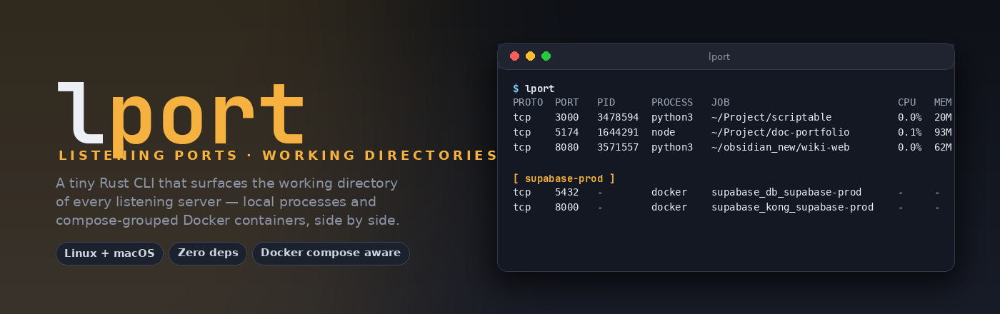

<div align="center">



[](https://github.com/Bae-ChangHyun/lport/releases)
[](LICENSE)
[](#requirements)
[](https://www.rust-lang.org/)
[](Cargo.toml)

**List listening ports on Linux and macOS — and the folder each server was launched from.**

[Quick start](#quick-start) · [Usage](#usage) · [How it works](#how-it-works) · [Releases](https://github.com/Bae-ChangHyun/lport/releases)

</div>

---

## About

A tiny (~550 KB, zero-dependency) Rust CLI that answers two questions you actually ask every day:

1. *Which port is `8080`?*
2. *Which folder did I `npm run dev` from to start that thing?*

`lport` shows the **working directory** of each listening server's process — so you instantly know which project a port belongs to. Docker compose containers are grouped by project, so sibling services (`supabase_db_*`, `supabase_kong_*`, …) read as one block instead of a scattered list.

### Why?

`lsof -i` and `ss -tlnp` tell you which PID owns a port. They don't tell you which project that PID came from — and they treat every Docker container as just another opaque process.

`lport` adds the missing layer: each row carries the cwd (or the compose project working directory), and Docker rows roll up under a `[ project ]` header so a stack reads as one block.

## Quick start

```bash
curl -sfL https://raw.githubusercontent.com/Bae-ChangHyun/lport/main/install.sh | sh
```

Requires the Rust toolchain (the script tells you how to install it in one line if missing). Re-running the installer detects the version on disk and skips work when you're already on the latest release; pass `--force` to reinstall anyway.

```bash
# fresh install or auto-upgrade
curl -sfL https://raw.githubusercontent.com/Bae-ChangHyun/lport/main/install.sh | sh

# force reinstall
curl -sfL https://raw.githubusercontent.com/Bae-ChangHyun/lport/main/install.sh | sh -s -- --force

# or directly via cargo
cargo install --git https://github.com/Bae-ChangHyun/lport
```

## Usage

```bash
lport                    # dashboard: user servers + docker containers
lport --dev              # everything (system daemons included)
lport info 8080          # detail block for a single port
lport info 8080 5432     # multiple ports
lport kill 3000          # SIGTERM the process(es) listening on port 3000
lport kill -9 3000 8080  # SIGKILL multiple ports
lport kill -y 3000       # skip the [y/N] prompt (non-interactive)
sudo lport               # full visibility into other users' processes
```

### Dashboard

<p align="center">
  
</p>

The default view groups Docker containers by their `com.docker.compose.project` label (falling back to the container name), so sibling containers of the same compose project read as one `[ project ]` block. Local rows show the full working directory in the `JOB` column with `$HOME` abbreviated to `~`. The column is **never truncated** — losing the path would defeat the feature.

### Detail view

<p align="center">
  
</p>

`lport info PORT...` filters to the requested ports before reading per-PID state, so a single-port query stays cheap. The block surfaces user, CPU, MEM, threads (Linux), uptime, working directory, and the full command line. For Docker-backed ports, it adds container name, image, compose working directory, and live `docker stats` CPU / MEM.

### Killing a port

<p align="center">
  
</p>

`lport kill PORT [PORT ...]` sends `SIGTERM` by default; pass `-9` or `--force` for `SIGKILL`. A PID listening on multiple ports (or on tcp+udp) receives one signal, not many. Each process is confirmed with a `[y/N]` prompt; pass `-y` / `--yes` to skip it for non-interactive callers (scripts, service managers).

Sending a signal is not the same as the process obeying it, so `lport` waits up to 3 seconds for the PID to actually disappear before reporting `killed`. If a process survives `SIGTERM`, an interactive run offers to escalate to `SIGKILL`; a non-interactive one prints a `lport kill -9 PORT` hint and exits `1`. When a killed port starts listening again moments later, `lport` warns that a supervisor (dev server, systemd) most likely restarted it.

Docker-backed ports are **not** killed — `lport` prints the matching `docker stop <name>` command instead. Container lifecycle is outside `lport`'s scope.

```
$ lport kill 5432
port tcp/5432: owned by Docker container 'supabase_db_supabase-prod'. Use: docker stop supabase_db_supabase-prod
```

Exit code is `0` on full success, `1` if any port had no listener / was Docker-backed / failed to signal, and `2` on argument errors.

### Update notice

Every invocation reads `~/.cache/lport/update-check`. When a newer upstream version is cached, `lport` prints a one-line notice underneath its normal output. On a TTY it also prompts:

```
●  update available: lport 0.6.0 → 0.7.0   install now? [y/N]
```

Pressing `y` runs `cargo install --git https://github.com/Bae-ChangHyun/lport --force`; anything else (including just hitting Enter) skips. When stdout is piped or you're not on a TTY, only the notice is printed — no prompt.

The cache is refreshed in the background (detached `curl` against `main`'s `Cargo.toml`, 24 h TTL) so the check never delays startup. Set `LPORT_NO_UPDATE_CHECK=1` to disable both the notice and the background fetch.

## How it works

On **Linux**:

- `ss -tlnpH` and `ss -ulnpH` for TCP/UDP listening sockets
- `/proc/<pid>/{cwd,cmdline,stat,exe}` read directly — no extra process spawn
- `ps -o pid=,pcpu=,rss=,nlwp=,etime=,user=` (one batched call) for CPU / MEM / uptime / user

On **macOS**:

- `lsof -nP -iTCP -sTCP:LISTEN` and `lsof -nP -iUDP` for TCP/UDP listening sockets
- `lsof -a -p <pids> -d cwd` (one batched call) for each process's working directory
- `ps -o pid=,tty=,comm=` (pass 1) for TTY + executable basename
- `ps -o pid=,command=` (pass 2) for the full command line
- `ps -o pid=,pcpu=,rss=,etime=,user=` for CPU / MEM / uptime / user

BSD `ps` on macOS has no `nlwp` (thread count), so the `THREADS` row is Linux-only.

And on both:

- `docker ps` for container/image/compose-project mapping, keyed by `(proto, host-port)` so TCP and UDP on the same port stay distinct. The `com.docker.compose.project` label drives the dashboard grouping; rows fall back to the container name when there is no label.
- `docker stats --no-stream <name>` (only in `info` mode) for container CPU / MEM

Dashboard runs in ~130 ms on Linux. macOS is slightly slower because it shells out to `lsof` / `ps` instead of reading `/proc`. The `info` and `kill` subcommands filter to the requested port(s) before enriching, so single-port operations do not pay the whole-system cost; Docker adds ~1 s when a container is involved.

## Requirements

- Linux or macOS
- `ps` — present on every Unix
- Linux: `iproute2` (`ss`) — present on virtually every distro
- macOS: `lsof` — preinstalled
- Optional: `docker` for container mapping
- Optional: `curl` for the background update check (skipped if missing)

## Limitations

- **Unix only.** Windows is not supported.
- Without `sudo`, processes owned by other users show as `?` (Linux) or are hidden entirely (macOS — `lsof` cannot read foreign process state without privileges).
- Containers started with plain `docker run` (not compose) display `WORKDIR: -` — Docker doesn't record the CLI invocation directory.

## License

MIT — see [LICENSE](LICENSE).
